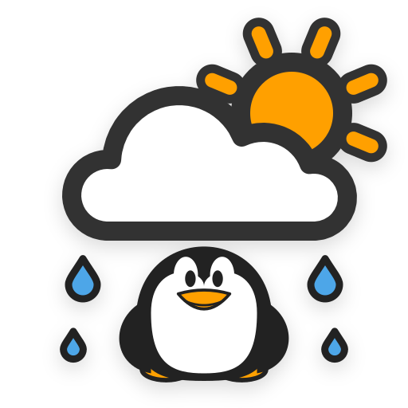

# Wetter &nbsp;


Current weather and forecasts in the GNOME Shell top bar, for as many
locations as you like.

- Current conditions: temperature, feels like, humidity, pressure, visibility,
  wind, sunrise and sunset
- Hour-by-hour forecast for up to 48 hours and a daily forecast for up to 10 days
- Search and add cities by name, and switch between them from the menu
- Optional current location, detected with GeoClue and updated as you move
- Optional alert when rain, snow or a thunderstorm is forecast within the next
  two hours
- Choose what the panel shows and where, units, 12/24-hour time, and symbolic
  or full-color icons

**Supported GNOME Shell versions:** 49, 50

This is a fork of [Neroth/gnome-shell-extension-weather](https://github.com/Neroth/gnome-shell-extension-weather),
ported to the module system and APIs GNOME Shell has used since version 45,
and to `libgweather-4` (which dropped the `GWeather.LocationEntry` widget the
original relied on for its "add city" dialog — replaced here with a
from-scratch location search).

## Installation

1. Clone the repository:
   ```bash
   git clone https://github.com/mlkonrad/wetter.git
   ```

2. Copy to your GNOME extensions directory:
   ```bash
   cp -r wetter ~/.local/share/gnome-shell/extensions/wetter@mlkonrad.github.com
   ```

3. Compile the settings schema:
   ```bash
   glib-compile-schemas ~/.local/share/gnome-shell/extensions/wetter@mlkonrad.github.com/schemas/
   ```

4. Restart GNOME Shell and enable the extension:
   ```bash
   gnome-extensions enable wetter@mlkonrad.github.com
   ```

## Configuration

Open **Wetter Settings** from the panel dropdown (or `gnome-extensions prefs
wetter@mlkonrad.github.com`) to add/remove locations, switch units, and
change how the panel indicator looks.

### Current location

Turn on **Current Location** in the Locations section of settings to add a
selectable entry that tracks where you are, via [GeoClue](https://gitlab.freedesktop.org/geoclue/geoclue),
alongside any cities you've added by hand. It refreshes itself automatically
as your location changes — no manual re-adding a city after a trip.

### Privacy

If no location has been added yet, **Current Location** is turned on by
default; switch it off in settings to use only the cities you add. The
location is detected by GeoClue at city-level accuracy (GNOME lists the
request as coming from GNOME Shell, since extensions run inside it). The
selected city is sent to the weather services libgweather uses — MET Norway,
OpenWeatherMap and METAR airport reports — to fetch its forecast.

## Debug

Watch `journalctl --user` for Shell errors (search for `wetter` in the
stack traces).

## License

Copyright (C) 2011 - 2026

* Christian METZLER \<neroth@xeked.com\>,
* Elad Alfassa \<elad@fedoraproject.org\>,
* Mark Benjamin \<weather.gnome.Markie1@dfgh.net\>,
* Simon Claessens \<gagalago@gmail.com\>,
* Ecyrbe \<ecyrbe+spam@gmail.com\>,
* Timur Kristóf \<venemo@msn.com\>,
* Simon Legner \<Simon.Legner@gmail.com\>,
* Mattia Meneguzzo \<odysseus@fedoraproject.org\>,
* Marlon Konrad (GNOME 45+/libgweather-4 port).

This file is part of *Wetter*.

*Wetter* is free software: you can redistribute it and/or modify it
under the terms of the GNU General Public License as published by the Free
Software Foundation, either version 3 of the License, or (at your option) any
later version.

*Wetter* is distributed in the hope that it will be useful, but
WITHOUT ANY WARRANTY; without even the implied warranty of MERCHANTABILITY or
FITNESS FOR A PARTICULAR PURPOSE. See the GNU General Public License for more
details.

You should have received a copy of the GNU General Public License along with
*Wetter*. If not, see <http://www.gnu.org/licenses/>.
